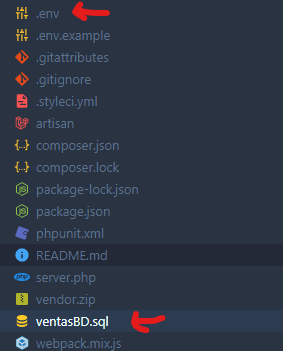
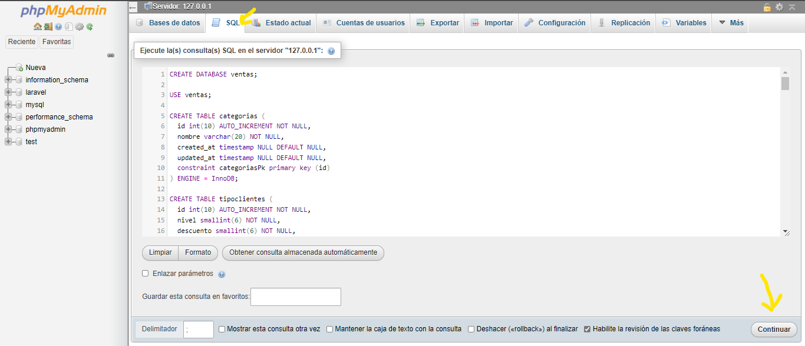
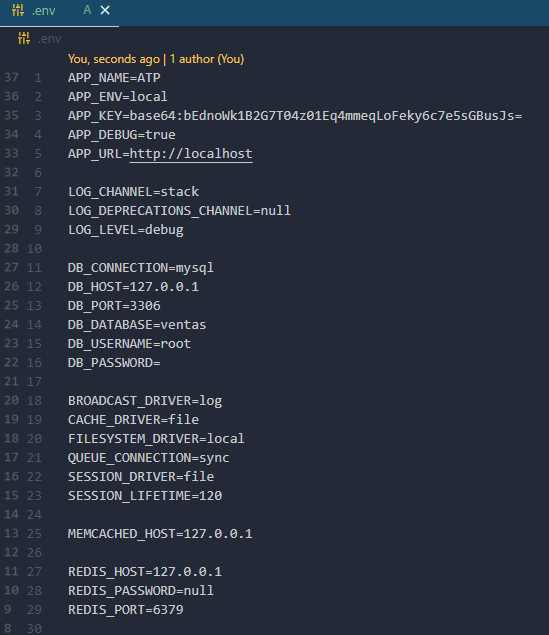
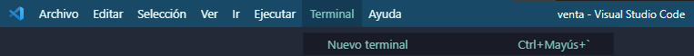
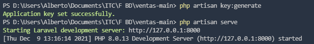
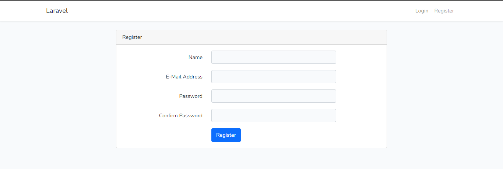
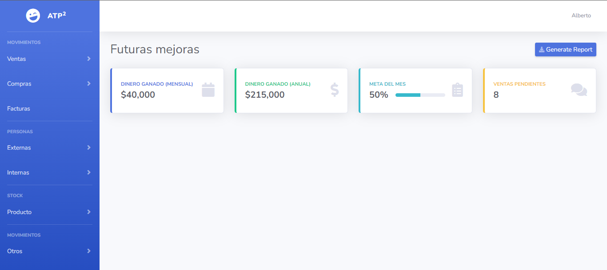

# Lanzar aplicación

## Requerimientos

Necesitamos lo siguiente:

- PHP (XAMPP)
- Composer
- MySQL (XAMPP)

Por lo que instalamos los siguientes ejecutables en nuestra computadora.

[Apache Friends](https://www.apachefriends.org/es/index.html)

(Recuerda reiniciar tu computadora despues de instalar XAMPP)

[Composer](https://getcomposer.org/download/)

Despues descargamos/clonamos el proyecto de drive o github:

[Github](https://github.com/AlbertoValenciaMX/ventas)

[Google Drive](https://drive.google.com/drive/folders/1f0qWpcLXk8CsQShaBWZlhBA3-DqY2k1X?usp=sharing)

## Configuraciónre
Ubicamos nuestra carpeta en la que se descargo nuestro proyecto de ventas y lo abrimos en visual studio code o en algún editor similar.

Despues buscamos los archivos ventasBD.sql que nos servira para la creación de la BD y .env donde declaramos las variables de entorno.



Si instalaste XAMPP dirigete a [http://localhost/phpmyadmin](http://localhost/phpmyadmin) o cualquier otro entorno en el que puedas ejecutar los comandos mysql.

Copia y pega el contenido del archivo ventasBD.sql en la pestaña SQL y ejecutalo con "Continuar".



En el archivo .env busca las variables que empiezan BD las cuales nos serviran para indicarle a la aplicación como conectarse con nuestra base de datos.

Configura todas las variables acorde a tu conexión, si no tienes contraseña en MySQL lo puedes dejar de la siguiente manera:

DB_CONNECTION=mysql
DB_HOST=127.0.0.1
DB_PORT=3306
DB_DATABASE=ventas
DB_USERNAME=root
DB_PASSWORD=admin123



## Montar el servidor

Despues abrimos una nueva terminal



y escribimos los siguientes comandos:

```bash
php artisan key:generator
php artisan serve
```



Nos dirigimos a [http://127.0.0.1:8000](http://127.0.0.1:8000/) y estara nuestro sistema funcionando, solo quedaria registrarnos e iniciar sesión.



Y nuestro sistema estaría funcionando de forma local.

